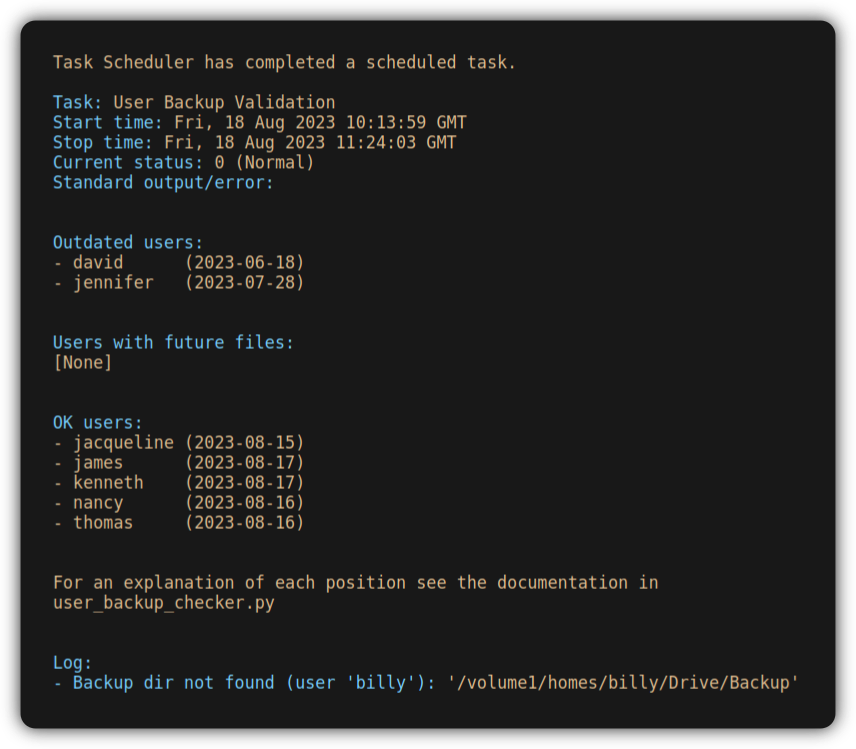

[](https://github.com/CodesByChris/user-backup-checker/actions/workflows/lint-and-test.yml)
[](https://codecov.io/gh/CodesByChris/user-backup-checker)


# User Backup Checker

Integrity checker for user backups performed via Synology Drive.



User Backup Checker (UBC) is a backend script for server administrators that warns them about users whose Synology Drive tool no longer performs backups.
Synology Drive is a precious tool enabling multiple users to perform backups and synchronize files to a central Synology server.
However, server administrators have no tool that actively alerts them when specific users stop performing backups, for example, because they forget to unpause Synology Drive or it can no longer reach the server after they change their passwords.
UBC periodically creates a report with the latest backup dates of users for administrators.
Optionally, it can automatically send emails to users with outdated backups and notify them about the problem.

UBC follows these design philosophies:
1. **Minimum configuration effort:**
    1. Dependencies only on _Python 3.8 standard library_, which comes pre-installed on newer Synology DSM versions.
    2. _Single-file solution_ (no caches or config files)
    3. UBC is _read-only_ and does neither modify nor create any files.
        It does not store databases, backup histories, or protocols.
        - Exceptions are actions the runtime environment performs outside UBC, such as Python automatically creating `__pycache__/` or server admins configuring log protocols on DSM to store UBC reports over time.
    4. _Periodic execution:_ UBC can be automated using Synology's default Task Scheduler.
        It does not require a continuous backup supervision process.
2. **Supports local and domain users.**
3. **Privacy-focused: UBC does not collect usage data.**
    UBC itself does not communicate with anything outside the server except for the emails to server admins and users.

UBC detects two types of issues in user backups:
1. **Outdated backups:**
    If the most recent modification date of any file in a user's backup directory is older than a specified number of days, UBC reports the user's backup as outdated.
2. **Future-dated files in backups:**
    If the most recent modification date of any file in a user's backup directory is in the future, UBC reports this user as future-dated.
    This scenario may, for example, arise when a user sets timestamps manually or when checking OS-related applications.
    However, such future-dated timestamps may confuse UBC's backup recency-detection algorithm.
    This algorithm determines whether the newest file's modification date is not older than a given number of days.
    As a result, a future-dated timestamp could wrongly appear recent for a significant period, potentially hundreds of years, thereby shadowing the user's actual backup process.
    To avoid misclassifications, UBC reports such users in a separate category.

UBC is a third-party script that has no association with Synology.


## Setup

Follow these steps to set up UBC on a Synology server.
To complete this setup, you need Synology server admin privileges.
Note that the optional email notifications for users with outdated backups have to be configured separately, see [Configuration](#configuration).

1. Open `ubc/user_backup_checker.py` in a text editor and adjust the settings to your preferences.
    See also [Configuration](#configuration) for the details.
2. Log in to Synology DSM with the admin account intended to run UBC.
    - **Ensure this account has read permissions for all user backup directories; otherwise, UBC cannot validate backups.**
3. Open _File Station_ and navigate to the directory where you wish to store the UBC script.
    For example, let's use `/volume1/homes/admin/`.
4. Upload `ubc/user_backup_checker.py` to this directory.
    The script path should now be: `/volume1/homes/admin/user_backup_checker.py`
5. Open _Control Panel_, then navigate to _Task Scheduler_ &rarr; _Create_ &rarr; _Scheduled task_ &rarr; _User-defined script_.
6. This leads to a _Create task_ dialog, which you can fill in as follows:
    1. _General:_
        - Provide a task name, like `User Backup Checker`.
        - Select the admin account for UBC execution.
        - Select _Enabled_.
    2. _Schedule:_
        - Define the days, times, and frequency for executing UBC.
    3. _Task Settings:_
        - Choose _Send run details by email_ and enter an email address if you wish to receive UBC reports by email.
            - Note: This setting only concerns admin emails.
                UBC directly sends emails to users with outdated backups.
            - Note: this setting requires an email account configured in _Control Panel_ &rarr; _Notification_ &rarr; _Email_.
        - Under _Run command_, write:
            ```
            python3 /volume1/homes/admin/user_backup_checker.py
            ```
            Adjust the path to match your setup.
7. Confirm with _OK_.

Done!


## Configuration

### Regular Settings

This section explains the settings that you can set in `ubc/user_backup_checker.py`.
All settings are contained in the dict `CONFIG`.
(`user_backup_checker.py` can be loaded as a module, which allows to set settings in an external script and leave the original file unchanged!)

The settings are:
- `USERS_TO_EXCLUDE`:
    Usernames that UBC shall not check, given as a Python `set`.
    You can mix local and domain users here, and UBC ensures that usernames are unique across both types.
- `USER_DETECTION_LOOKUPS`:
    - Nested dictionary structure specifying UBC's search patterns to detect users and their backup directories on the Synology server.
        - _Outer dictionary level:_ Keys are the user types (e.g. `local`, `domain`) and values are the corresponding search patterns (see inner dictionary level).
        - _Inner dictionary level:_ Inner dicts have two keys:
            1. `"home_dirs_glob"`: Glob pattern that expands to the users' home folders.
                The last component of each matched path has to be the user name.
            2. `"backup_subdir"`: Path to the Synology Drive backup folder relative to a user's home folder.
    - See here for naming and location of home directories of domain and LDAP users: https://kb.synology.com/en-us/DSM/help/DSM/AdminCenter/file_directory_service_user_group?version=7
- `EXCLUDE_WEEKENDS`: If `True`, Saturdays and Sundays are not counted towards the age of a backup.
    Moreover, if `True`, UBC sends no emails to individual users on these days either.
    This setting is useful, for example, if all users work Monday to Friday.
- `TOLERANCE_FUTURE`:
    - Number of days into the future in which UBC does not consider modification dates of files as future-dated yet.
        Setting this tolerance may be useful if users in different time zones perform backups.
- `TOLERANCE_OUTDATED`:
    - Maximum age of a backup to not be considered outdated yet.
- `REMINDER_INTERVAL`:
    - Interval (in days) at which UBC sends users a reminder email for their outdated backup.
        For example, a value of `timedelta(days=1)` means that users shall receive an email every single day after the age of their backup surpasses `TOLERANCE_OUTDATED`, or `timedelta(days=3)` means that they receive such an email only every three days.
        Emailing users daily may be counter-productive because they may start ignoring these emails.
        (This setting is only used when user notifications are enabled.)
- `SUBJECT_OUTDATED`:
    - Subject of an email to a user with an outdated backup.
        (This setting is only used when user notifications are enabled.)
- `MAIL_OUTDATED`:
    - Text of an email to a user with an outdated backup.
        This message needs to contain the strings `{date}` and `{outdated_days}`, which will be replaced for each user separately by the date and age of the last backup.
        (This setting is only used when user notifications are enabled.)
- `SUBJECT_FUTURE`:
    - Subject of an email to a user with a future-dated backup.
        (This setting is only used when user notifications are enabled.)
- `MAIL_FUTURE`:
    - Text of an email to a user with a future-dated backup.
        This message needs to contain the strings `{path}` and `{date}`, which will be replaced for each user separately by the path and date of the future-dated file.
        (This setting is only used when user notifications are enabled.)
- `ADMIN_STATUS_REPORT`:
    - Text of status report to server admins.
        This message needs to contain the strings `{outdated_users}`, `{future_users}`, and `{ok_users}`, which will be replaced by the usernames of the outdated, future-dated, and OK users.


### Enabling User Notifications

...


## Copyright

UBC is released under the *GNU Affero General Public License v3.0*

Copyright 2023, ETH Zurich.

Developer: Christian Zingg as employee at Chair of Systems Design, ETH Zurich.
